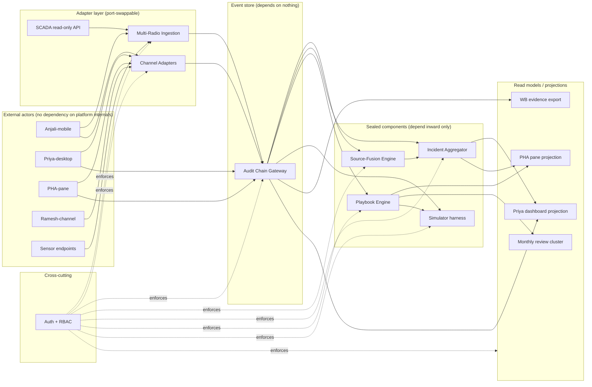
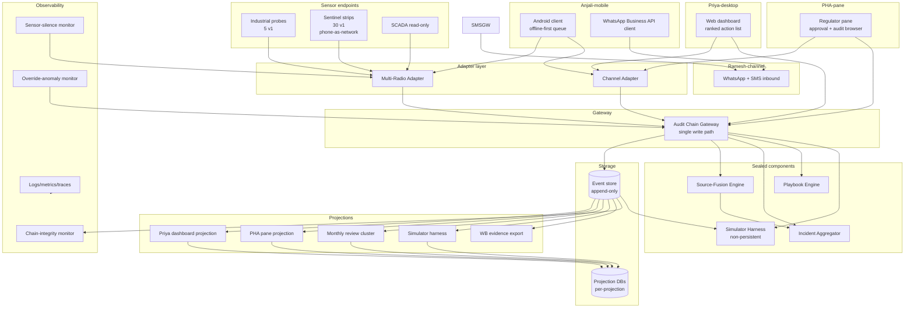
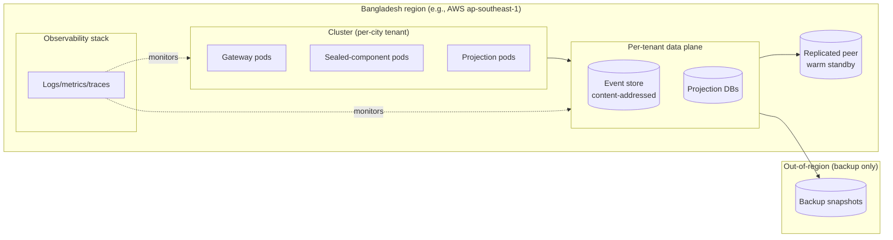

# Architecture Spine — Surakkha v1

## Design Paradigm

**Event-sourced core + CQRS read models.** All state changes are events written to an append-only stream. The audit chain gateway is the event store — not a separate log bolted onto operational state. Read models (projections) are derived from the event stream and serve Priya-desktop, PHA-pane, the fusion engine output, the simulator, and WB evidence export. Commands that mutate state (escalate, execute step, capture deviation, approve amendment, issue message) are issued against projections and emit new events.

This is not "an audit log plus CRUD." The audit chain IS the database.

The paradigm maps the spec's load-bearing choices onto structural invariants rather than conventional discipline:

| Spec load-bearing call | Paradigm expression |
|---|---|
| C-8 audit chain content-addressed with cryptographic chaining | Event store blocks are content-addressed; every block references prior hash |
| C-13 vendor/PHA/utility liability split via audit chain evidence | Each event carries the actor identity that caused it; replay proves who committed to what |
| FR-3.5 deviation is a first-class audit event type | DeviationCaptured is an event, not a flag on a step execution |
| FR-3.7 simulator is "what would have happened" | Simulator is event replay through a hypothetical playbook version |
| FR-6.3 PHA audit browser | Audit browser is event-stream query with filtering |
| C-7 fusion engine v1→v2 ML swap | Swap is a projection-rebuild, not a service change |

**Two aggregates, one stream.** Observations (SensorReading, AnjaliReport, Complaint, LabResult, EnvSignal) are first-class events written before fusion. Incidents are lazily materialized by the Incident Aggregator when fusion correlates ≥1 observation into a coherent story. After Incident creation, commands target the Incident aggregate (EscalateIncident, ExecutePlaybookStep, CaptureDeviation, ApprovePlaybookAmendment, IssueConsumerMessage). This hybrid keeps the write side simple and high-throughput while preserving the operator's mental model of an Incident.

## Inherited Invariants

The spec's `architecture-invariants.md` already commits to specific design calls. These are inherited as ADOPTED — read-only, not re-derived here.

| Inherited | From | Binds here |
|---|---|---|
| Multi-tenant SaaS with per-city DB isolation | C-1 + architecture-invariants.md §1 | AD-5 (tenant isolation) |
| Three persona-specific UIs as separate products | C-2 + architecture-invariants.md §2 | AD-7 (UI boundaries) |
| Source-fusion engine sealed contract | C-7 + architecture-invariants.md §3 | AD-3 (component contracts) |
| Playbook engine sealed contract | architecture-invariants.md §4 | AD-3 (component contracts) |
| Channel adapters as pluggable ports | architecture-invariants.md §5 | AD-3 (component contracts) |
| Audit chain single gateway + content-addressed chaining | C-8 + architecture-invariants.md §6 | AD-1 (event store = audit chain) |
| Auth + RBAC defense-in-depth | architecture-invariants.md §7 | AD-6 (RBAC), AD-12 (closed role enum) |
| Multi-radio connectivity tiers | C-15 + architecture-invariants.md §8 | AD-8 (multi-radio contract) |
| Tiered PHA-approval SLA per contaminant class | C-3 (amended) | AD-11 (two-person rule), AD-15 (change authority) |
| Liability split vendor / PHA / utility | C-13 | AD-12 (actor identity) |
| WHO-grounded playbook template library | C-14 | AD-13 (playbook version-of-record), AD-15 (config changes) |
| WB procurement — no proprietary lock-in | C-16 | AD-10 (vendor-neutral observability), AD-9 (no foreign active write path) |
| SMS first-class for Anjali | C-11 | AD-8 (multi-radio) |
| Sentinel strip QA third-party lab cert | C-9 | architecture-invariants.md §3a (operational, not architectural) |
| Privacy-by-default (zone-geofence, anonymize, RTBF) | C-10 | AD-5 (isolation), AD-16 (RTBF mechanism) |

## Invariants & Rules

### AD-1 — Event store IS the audit chain

- **Binds:** CAP-6 + C-8; all state mutations across all components.
- **Prevents:** dual-writes between audit chain and operational state; "audit log" as a logging afterthought; retroactive tampering without detection.
- **Rule:** Every state change in the system is an event written to the audit chain gateway. No component writes to operational storage directly; all reads of operational state are projections of the event stream. The chain is content-addressed and each block references the prior block's hash (per C-8). Per-city namespace; federation operates on aggregated projections only.

### AD-2 — Hybrid aggregate model (Observation + Incident)

- **Binds:** CAP-5 + FR-2 (fusion) + FR-5 (Priya incident dashboard).
- **Prevents:** the write-side bottleneck of correlating-and-then-writing (incident-centric) and the command-target-projection gap of pure-observation (observation-centric).
- **Rule:** Observations are first-class events written to the stream independently of any incident. The Incident Aggregator reads the observation stream and materializes an Incident when ≥1 observation correlates into a coherent story (configurable per contaminant class). Before Incident creation, the observation is queryable but has no incident-level commands. After Incident creation, commands target the Incident aggregate; the command path emits Incident-scoped events. Both observation and incident events live in the same store. **Incident identity is content-addressed:** `incident_id = sha256(canonical(observation_event_ids[] | tenant_id | correlation_window_id | contaminant_class))`. The Incident Aggregator is the **sole writer** of `IncidentCreated` events — no other component may emit one. Correlation window configuration lives in `platform-config/` (per-city, per-class) and is read identically by the fusion engine and the Incident Aggregator; both must agree on the window or incident ledgers diverge.

### AD-3 — Sealed-component contracts

- **Binds:** CAP-5, CAP-7; FR-2, FR-3; architecture-invariants.md §3, §4.
- **Prevents:** the v2 swap breaking consumer contracts; silent drift between fusion v1 (weighted voting) and fusion v2 (ML); silent drift between playbook engine v1 and v2.
- **Rule:** Each sealed component exposes a stable input/output contract, versioned. Consumers depend on the contract, not on the implementation. v2 changes the implementation, not the contract. The fusion engine contract is `{5 inputs} → ranked 4-6 incident list with attribution and confidence}`. The `source_attribution` payload field is pinned: `[{observation_id: ULID, source_type: enum{anjali_report, sensor_reading, lab_result, complaint, env_signal}, weight: float, observed_at: ISO8601}]` — not free-form strings. The playbook engine contract is `{execution, deviation, amendment, versioning, confidence, simulator}` per architecture-invariants.md §4. The simulator harness is a sealed component that **does not persist** — its inputs are read from the event stream; its outputs (ranked incident lists under hypothetical playbook versions) are returned to the caller but not written back. Sealed components: Audit Chain Gateway, Source-Fusion Engine, Incident Aggregator (added; was implicit in the spec), Playbook Engine, Simulator Harness, Channel Adapters, Multi-Radio Ingestion, Auth + RBAC, UIs.

### AD-4 — Event-schema evolution: strict versioning + upcasters

- **Binds:** AD-1 (event store); all consumers of any event.
- **Prevents:** schema drift between v1 and v2; projection rebuild failures on schema change; silent loss of old events during evolution.
- **Rule:** Every event schema has a version (v1, v2, v3…). New versions add fields but never rename or remove. Old events are upcasted on read by per-version upcaster functions. Projection rebuilds replay from genesis; upcasters apply per-version transforms inline. The chain itself never migrates — the store is append-only; evolution happens at the read boundary. Schema registry is per-city-tenant. **Schema-version bumps require PHA + vendor dual sign-off** — bumping is a two-person-rule event in the same way T3-boundary amendments are (AD-11). **Upcasters are owned by the component that owns the event type** — every event-type owner maintains the upcaster for its schema versions, ships the upcaster in lockstep with the version bump, and the chain-integrity monitor flags any projection that lags behind the latest upcaster.

### AD-5 — Strict logical per-tenant isolation

- **Binds:** C-1 + C-10; CAP-6 + CAP-7; PRD §5.4.
- **Prevents:** cross-tenant data leakage; accidental federation reads; data-sovereignty violations.
- **Rule:** Each tenant city has its own logical database with its own audit-chain namespace. No cross-tenant joins at any layer (gateway, service, data-access). Federation (v2+) operates on aggregated projections only — never on raw cross-city reads. Tenant isolation is verified at all three RBAC layers (AD-6).

### AD-6 — RBAC enforcement is defense-in-depth, three layers

- **Binds:** C-10 + architecture-invariants.md §7; all components.
- **Prevents:** the "single check is load-bearing" failure mode; RBAC gaps surfacing as access-policy violations without audit evidence.
- **Rule:** Permission checks at (1) gateway / admission, (2) service boundary / component-internal, (3) data-access layer / storage query. The auth service is a component; the policy matrix is per-city; enforcement is a cross-cutting concern. Every access is logged to the audit chain (FR-1.5). Override-anomaly detection is logged in v1, enforced in v2 (architecture-invariants.md §7).

### AD-7 — Three UIs as separate products with separate deploys

- **Binds:** C-2 + CAP-1 + CAP-2 + CAP-3; architecture-invariants.md §2.
- **Prevents:** one responsive app collapsing the persona wins; shared release cadence coupling Anjali-mobile / Priya-desktop / PHA-pane.
- **Rule:** Anjali-mobile (Android, WhatsApp-fronted, offline-first), Priya-desktop (web dashboard), and PHA-pane (read-mostly regulator pane) are three separate products with separate deploy cadences. They communicate via the audit chain gateway and the channel adapters, not via shared UI code. No shared component library above the data-layer.

### AD-8 — Multi-radio contract enforced at gateway

- **Binds:** C-15 + architecture-invariants.md §8; FR-1.4 + FR-4.3 + FR-4.4.
- **Prevents:** sensor silence being silently dropped; cross-adapter inconsistency in fallback; gap between " sensor offline " and " sensor silent = audit event ".
- **Rule:** Every sensor ingest request declares a radio tier (cellular primary → LPWAN secondary → SD-card store-and-forward tertiary). The gateway routes through the right adapter based on declared tier. Adapters are port-swappable (C-15). Sensor silence beyond a configurable threshold is itself logged as a `SensorSilenceObserved` event to the audit chain (per spec §3 of detection-layer.md). Anjali's phone acts as the network endpoint for ward sentinel (phone-as-network).

### AD-9 — Single-region Dhaka deployment for v1

- **Binds:** PRD §5.4 (data residency); NG-5 (no federation v1); C-16 (WB funding — single-city procurement).
- **Prevents:** premature multi-region complexity; cross-region data sovereignty violations.
- **Rule:** v1 ships single-region in Bangladesh. Audit-chain gateway writes to local + a single replicated peer. WB evidence export runs as a scheduled job. Multi-region active-active is a v2-on upgrade when federation activates. Backup snapshots are out-of-region; the active write path stays in Bangladesh.

### AD-10 — Operational observability is internal + vendor-neutral

- **Binds:** C-8 (audit chain integrity monitoring); C-16 (WB procurement — no proprietary lock-in); PRD §5.5.
- **Prevents:** vendor lock-in for an audit-chain-bound platform; chain-integrity drift undetected; sensor-silence exceeding threshold without operator awareness.
- **Rule:** Observability stack is internal — structured logs, metrics, traces — with vendor-neutral tooling. Monitors: (a) chain-integrity monitor verifying the hash chain every N minutes; (b) sensor-silence monitor alerting on any sensor silent beyond threshold; (c) override-anomaly monitor (logged v1, enforced v2). Logs themselves are events; the chain is the source of truth for everything the platform does, including its own operational state.

### AD-11 — Two-person rule on T3-boundary and consumer-message events

- **Binds:** C-3 + C-4 + C-8; CAP-3 + CAP-4; FR-6.1.
- **Prevents:** single-actor mutation of politically sensitive state; loss of dual-signature evidence under inquiry.
- **Rule:** Events of type `PlaybookAmendmentApproved` (when the amendment touches the T3 boundary) and `ConsumerMessageIssued` require dual signatures. Both signatures must attest to the **identical `(event_id, payload_hash, version_id)` triple** — the second signature cannot land against a typo-correction v2 after the first attested v1. Implementation uses the linked `SignatureAttestation` pattern (Consistency Conventions row): the second signature emits a `SignatureAttestation` event that references the first and the triple; the gateway accepts the underlying command only after both attestations with matching triples are recorded. The two signatures identify distinct actor identities per the closed role enum of AD-12 (vendor / PHA approver, or PHA approver / utility operator as appropriate per C-13).

### AD-12 — Liability split is encoded in event actor identity

- **Binds:** C-13; CAP-6; PRD §5.5.
- **Prevents:** the liability split becoming a contractual claim rather than a structural property of the system; "who committed to what" becoming unanswerable under inquiry.
- **Rule:** Every event carries an `actor_identity` field with two sub-fields: `role` (closed enum, per-city-tenant matrix: `{vendor, pha_approver, utility_operator, anjali, priya, pha_viewer, system}` — strictly this set, never a free-form string) and `ref` (a unique actor reference resolved from the auth-service session token, **not** minted by the emitting component). The gateway **rejects events whose `role` is not in the closed enum or whose `ref` cannot be resolved to a live auth-session reference** — this is enforced at write-rejection, not as a soft check. The vendor's liability boundary ends at events the vendor's actors emitted; the PHA's liability boundary covers PHA-actor events; the utility covers utility-actor events. The audit chain is the evidence surface for the split; the closed enum + session-bound ref make the split structural, not contractual.

### AD-13 — Playbook version-of-record is content-addressed; simulator reads from the event stream

- **Binds:** AD-1 (event store), AD-3 (sealed components); FR-3.7 (simulator); C-3, C-13, C-14.
- **Prevents:** two units disagreeing on "what version of the playbook was active when this incident ran"; simulator outputs diverging under DR; abandoned draft branches silently being treated as live.
- **Rule:** Every `PlaybookVersionPublished` event carries a `version_id = sha256(canonical(serialized_playbook_definition))`. The version-of-record is the latest `PlaybookVersionPublished` event for the tenant — **not** a DB row, not a projection. Lineage is linear: each new version references its predecessor via `parent_version_id`; concurrent drafts emit `PlaybookVersionDrafted` events and only one can be promoted to `PlaybookVersionPublished` per tenant. Abandoned drafts emit a `PlaybookVersionAbandoned` event (not a deletion — append-only). The Simulator Harness **reads its inputs from the event stream** (events in a time window + a hypothetical version_id), never from a projection — so simulator output agrees with the chain under DR or projection-rebuild. The simulator does not write back to the chain (per AD-3 non-persistence property).

### AD-14 — Idempotency by (tenant_id, event_id)

- **Binds:** AD-1 (event store); all event-emitting components; FR-1 (audit chain), FR-4 (offline-first sync).
- **Prevents:** duplicate events from SD-card store-and-forward replay; mobile reconnect storms producing N copies of the same Anjali report; double-counting in fusion and aggregation; double-incidents.
- **Rule:** Every event carries a client-minted `event_id` (ULID). The gateway **rejects events whose `(tenant_id, event_id)` pair is already present in the store** with a typed `DuplicateEventRejected` response — silent dedup is forbidden because the chain must show the attempt. Mobile and SD-card adapters are responsible for generating a stable `event_id` once per logical event (at user-acknowledged submission time, not at retry time). Re-tries of the same logical event reuse the same `event_id`. This rule closes the only path by which idempotency could fail under multi-radio store-and-forward.

### AD-15 — Change-management authority is structured, not ad hoc

- **Binds:** AD-4 (schema-versioning), AD-13 (playbook-versioning); all components; C-14 (WHO template library as v1 deliverable).
- **Prevents:** two teams publishing divergent schemas or divergent playbook versions under the same version label; the platform-config projection diverging from what the running components actually read; an unauthorized actor changing city-wide escalation thresholds.
- **Rule:** Three categories of platform-wide change each have a named authority and a dual-signature event:
  - **Event schema bump** → owned by the event-type owner; dual-signed by `vendor` + `pha_approver` (per AD-4); emits `SchemaVersionBumped`.
  - **Playbook version promotion (draft → published)** → owned by the Playbook Engine component; dual-signed by `pha_approver` + `utility_operator` (per AD-13); emits `PlaybookVersionPublished`.
  - **City-wide config change** (correlation windows, escalation thresholds, fusion weights, role matrix) → owned by the PHA per-tenant; single-signed `pha_approver` (config changes are not dual-signed, but the change is logged with `before/after` payload diff and the auditor can replay the change history); emits `CityConfigChanged`.
  All three are event-sourced and replayable; the running components read config from the projection, which is rebuilt by replaying these events. There is no out-of-band config-update path.

### AD-16 — Retention floor + RTBF via tombstone events (append-only reconciliation)

- **Binds:** C-10 (privacy-by-default including RTBF); AD-1 (append-only chain); AD-5 (per-tenant isolation).
- **Prevents:** append-only being silently violated by deletion; RTBF being honored in operational storage but not in the audit chain (or vice versa); retention periods drifting silently.
- **Rule:** The chain is **append-only and tamper-evident**; nothing in it is ever rewritten or deleted. Right-to-be-forgotten is honored by emitting a `SubjectRedacted` event that references the subject's `actor_ref` (or the geofenced `subject_geo_id`); downstream projections must apply the redaction on read (the subject's `payload` fields become `null` / `redacted`, but the event itself remains in the chain as evidence of the request). Retention floor per tenant (default 7 years, set per WB / city contract — see C-16) is enforced by the chain-integrity monitor; events older than floor are exported to immutable out-of-region cold storage (per AD-9) and the live projection continues to serve them via lazy restore. The dual principle: **the chain remembers everything; the projection forgets what the law requires it to forget.**

## Dependency Direction



**Reading the diagram.** External actors (Anjali, Priya, PHA, Ramesh, sensors) never reach into the sealed core; they go through adapters. Adapters depend on the audit chain gateway, not on storage. The sealed components (Fusion, Incident Aggregator, Playbook Engine) read from the store and depend on each other only through the store. Projections are read-only views; they never write back to the store. RBAC is a cross-cutting enforcer, drawn dotted. **The audit chain gateway is the only component that may depend on storage** — every other component's storage access goes through projections of it.

## Consistency Conventions

| Concern | Convention |
|---|---|
| **Identifiers** | ULIDs (lexicographically sortable, time-ordered) for all entity IDs (sensor_id, anjali_id, incident_id, playbook_version_id, event_id). Tenant prefix: `{tenant_id}:{entity_id}`. Federation IDs use a separate namespace and are never used inside tenant scopes. |
| **Event envelope** | Every event: `{schema_version, tenant_id, event_type, event_id, occurred_at, ingested_at, actor_identity, correlation_id, causation_id, payload}`. `payload` is the per-event-type body. `correlation_id` links events to a logical operation; `causation_id` links to the event that caused this one. |
| **Event timestamps** | UTC always; `occurred_at` is the source-side time; `ingested_at` is the gateway time. Skew between them is captured but not normalized. |
| **Errors** | Errors are events (`CommandRejected`, `ProjectionFailed`, `ChainVerificationFailed`). No exceptions cross component boundaries as raw exceptions; they become events with a typed payload. |
| **Logging** | Application logs are operational; the chain is the audit log. Application logs are not load-bearing; chain events are. |
| **Configuration** | Per-city config is part of the tenant namespace. Cross-city config (defaults, WHO template library, fusion weights) lives in a shared "platform-config" projection, not in tenant stores. |
| **Tenant scoping** | Every event, projection query, and adapter call MUST carry a tenant_id. Missing tenant_id is a request-rejection condition (gateway-enforced). |
| **Two-person signatures** | Implemented as a multi-actor event emission: the second signature emits a `SignatureAttestation` event that references the first; the gateway accepts the underlying command only after both signatures attest to the **identical `(event_id, payload_hash, version_id)` triple** (per AD-11). |
| **Override / deviation** | All overrides emit an `OverrideRecorded` or `DeviationCaptured` event distinct from the underlying state change event. The override event is the audit trail; the state change is its consequence. |
| **Version-of-record** | Playbook version-of-record is the latest `PlaybookVersionPublished` event for the tenant (per AD-13) — not a DB row, not a projection. Schema version-of-record is the latest `SchemaVersionBumped` event on the schema-registry stream (per AD-4 + AD-15). |
| **Idempotency** | The gateway rejects duplicate `(tenant_id, event_id)` pairs with `DuplicateEventRejected`; adapters mint the `event_id` once per logical event at user-acknowledged submission time (per AD-14). |
| **Chain hash computation** | The cryptographic chain hash is **gateway-computed** at write-time and stored in the block header; the underlying store is unaware of chaining. The chain-integrity monitor re-verifies by recomputing forward and back. (Per AD-1 + AD-10.) |
| **Redaction** | RTBF and redactions are forward-only via `SubjectRedacted` events (per AD-16). The chain is never edited; projections apply redactions on read. |

## Stack

> **SEED.** Names only; versions verified by `bmad-spec` adoption / first implementation pass. The code owns this once it exists.

| Name | Version (target) |
|---|---|
| Event store | append-only log with content-addressed blocks; candidates are KurrentDB (current line v25.x; licensing under verification against C-16 WB procurement), Apache Kafka, or Postgres-with-append-only-table; selection deferred to stack pass |
| Language (core services) | TBD — see Deferred |
| Language (UIs) | Anjali-mobile: Android + WhatsApp Business API client; Priya-desktop + PHA-pane: web app |
| Adapter framework | TBD — see Deferred |
| Identity / RBAC | TBD — see Deferred |
| Observability | OpenTelemetry (CNCF Graduated) for instrumentation; open-source metrics/logs/traces backend (vendor-neutral per AD-10) |
| Cloud (active write path) | Bangladesh-resident provider required for AD-9 data residency; evaluation of local providers (Pathao Cloud, TigerIT Bangladesh cloud, government cloud) in progress; AWS ap-southeast-1 (Singapore) is acceptable as the **replicated peer** only, not as the active write path |
| WB evidence export | scheduled job reading from a projection (projection-not-recompute, per AD-13 lineage discipline); exports results-framework-compatible artifacts; **may not export raw PII or raw observations out of Bangladesh** — only aggregated, k-anonymized indicators per WB program requirements |

## Structural Seed

### System / Container view



### Deployment topology (v1 single-region Dhaka)



### Source tree (skeleton — owned by the implementing code, not the spine)

```text
surakkha/
  gateway/                  # Audit Chain Gateway — single write path (AD-1)
    chain/                  # content-addressed block store
    ingest/                 # event validation + tenant scoping
    query/                  # projection query API
  components/               # sealed components (AD-3)
    fusion/                 # Source-Fusion Engine
    incident-aggregator/    # lazy incident materialization (AD-2)
    playbook/               # Playbook Engine (FR-3.*)
    simulator/              # Simulator harness (FR-3.7)
  adapters/                 # port-swappable adapters (AD-3, AD-8)
    radio/                  # multi-radio adapter (cellular / LPWAN / SD)
    channel/                # channel adapters (WhatsApp / SMS / councillor)
    scada/                  # SCADA read-only
  projections/              # read models (CQRS)
    priya-dashboard/        # FR-5 ranked action list
    pha-pane/               # FR-6 PHA views
    cluster/                # FR-3.6 deviation cluster
    wb-export/              # FR-6.6 + C-16 evidence export
  rbac/                     # auth + RBAC, defense-in-depth (AD-6)
  ui/                       # three separate products (AD-7)
    anjali-mobile/          # Android + WhatsApp
    priya-desktop/          # web
    pha-pane/               # web
  observability/            # logs/metrics/traces + monitors (AD-10)
  platform-config/          # cross-city defaults; WHO template library (C-14)
  tenants/
    {tenant_id}/            # per-city configuration + state
```

## Capability → Architecture Map

| Capability / Area | Lives in | Governed by |
|---|---|---|
| CAP-1 Anjali one-tap reporting | `ui/anjali-mobile/` + `adapters/radio/` + `gateway/ingest/` | AD-7 (UI), AD-8 (multi-radio), AD-3 (channel adapter), C-11 |
| CAP-2 Priya ranked action list | `projections/priya-dashboard/` + `ui/priya-desktop/` + `components/fusion/` | AD-2 (hybrid aggregate), AD-3 (sealed components), AD-7 (UI) |
| CAP-3 PHA pane | `ui/pha-pane/` + `projections/pha-pane/` | AD-7, AD-3, C-3 (tiered SLA), C-13 |
| CAP-4 Ramesh consumer messaging | `adapters/channel/` + `components/playbook/` (escalation policy) | AD-3, AD-11 (two-person rule), C-4 |
| CAP-5 source fusion | `components/fusion/` | AD-3 (sealed contract), C-6, C-7 |
| CAP-6 audit chain | `gateway/chain/` + `gateway/ingest/` | AD-1 (event store = audit chain), AD-4 (schema evolution), AD-11, AD-12 |
| CAP-7 playbook lifecycle | `components/playbook/` + `components/simulator/` + `projections/cluster/` | AD-3, AD-11, AD-13, C-13, C-14 |
| FR-1 audit chain invariants | `gateway/` | AD-1, AD-4, AD-11, AD-12, AD-14, AD-16 |
| FR-2 fusion engine | `components/fusion/` | AD-3, C-6, C-7 |
| FR-3.5 deviation capture | `gateway/ingest/` (event type) + `components/playbook/` | AD-2, AD-12 |
| FR-3.7 simulator | `components/simulator/` | AD-3 (non-persistence), AD-13 (reads from event stream) |
| FR-4 Anjali offline-first sync | `ui/anjali-mobile/` queue + `adapters/radio/` | AD-8, AD-14, C-15 |
| FR-5 Priya ranked action list (and FR-5.6 auto-PHA-monthly-report) | `projections/priya-dashboard/` + `ui/priya-desktop/` + `components/fusion/` | AD-2, AD-3, AD-7 |
| FR-5.6 PHA monthly report (auto-generated from audit trail) | `projections/pha-pane/` (monthly cluster) | AD-13, AD-16, C-16 |
| FR-6 PHA audit browser | `projections/pha-pane/` + `gateway/query/` | AD-3, AD-12, AD-16 |
| FR-6.6 WB evidence export | `projections/wb-export/` | AD-9 (residency), AD-13 (projection-not-recompute), AD-16 (no raw PII out of region) |
| FR-7 consumer messaging (Ramesh) | `adapters/channel/` + `components/playbook/` | AD-3, AD-11 |

## Deferred

| Decision | Why deferred | Revisit trigger |
|---|---|---|
| **Event store implementation** (KurrentDB v25.x vs Apache Kafka vs Postgres-append-only) | Greenfield; licensing under verification against C-16 WB procurement; Bangladesh-region deployment constraints unknown | Stack selection pass during `bmad-create-epics-and-stories`; web-verify current versions and operational characteristics |
| **Language for core services** (Go vs Rust vs JVM vs Node) | No performance profiling data; team composition unknown at the spine level | First-hire / first-implementation pass |
| **Language for adapters** | Often matches core; possibly different for hot-path adapters (Rust for radio adapter) | Same as core language decision |
| **Identity provider / RBAC implementation** (OIDC, Auth0, Keycloak, custom) | WB procurement may constrain; also depends on whether PHA already has an IdP | Dhaka engagement scoping + first PHA integration conversation |
| **Bangladesh-resident cloud provider** for active write path | AD-9 requires Bangladesh-resident active write path; local providers (Pathao Cloud, TigerIT Bangladesh cloud, government cloud) under evaluation | A8 sub-task validation + first WB procurement cycle |
| **WB evidence export format** | Specific WB program (Bangladesh Water Security Program) determines disbursement-linked indicator format | OQ-10 finalization; first WB contact |
| **Anjali-mobile cross-platform** (native Android vs cross-platform) | Team composition; whether WhatsApp Business API has acceptable client SDK on each | First Anjali-mobile engineering hire |
| **Concrete event schemas for each event type** | Owned by the implementing code; spine fixes the *rule* (AD-4), not the schemas | First event schema design pass; logged as separate document |
| **Concrete projection schemas** | Same — owned by code; one coordinated pass to prevent fusion and playbook teams from diverging | First projection design pass (coordinated, not per-team) |
| **Simulator harness details** (event-replay library, snapshot strategy, performance budget) | Simulator is its own sealed component; contract fixed (AD-3 + AD-13), internals deferred | FR-3.7 implementation pass |
| **Multi-region DR topology specifics** (RPO/RTO targets, replication lag tolerance) | AD-9 sets single-region v1; DR is a v2-on question | Federation activation or scale-100K milestone, whichever first |
| **Concrete override-anomaly baseline + thresholds** | Architecture-invariants.md §7 says "logged v1, enforced v2"; the specific baselines require operational data | First 90 days of operation; v2 enforce pass |
| **Retention floor per tenant** (default 7 years noted) | Per WB / city contract — may differ for water-safety evidence vs. consumer-PII subdomains | First WB contract + PHA legal review |
| **WHO template library content** | C-14 v1 deliverable; authoring has not begun | PRD M1 milestone (launch prerequisite) |
| **Local-provider replicated peer** | Active path is Bangladesh-resident; replicated peer may be AWS ap-southeast-1 OR a second Bangladesh provider; cost + DR trade-off | Bangladesh provider selection + first DR exercise |