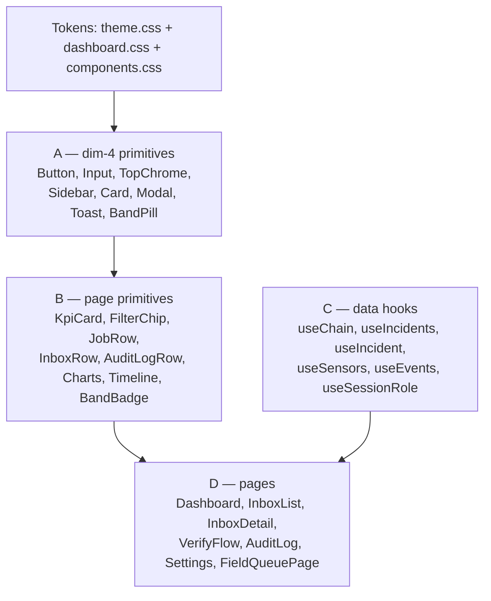
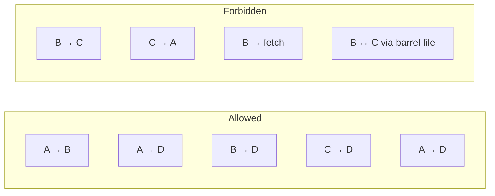

# Architecture Spine — surakkha-v1-frontend (Epic FE-1)

## Design Paradigm

**Layered component composition.** Every React file lives in exactly one of four layers; layers may only depend downward (D depends on B+C; B depends on A; C depends on nothing in this app; A depends on tokens only). Pages are thin compositions, primitives stay pure, hooks own data, tokens are the only source of visual truth.



The four layers map to directories:

```text
web/src/
├── components/
│   ├── ui/                # Layer A — dim-4 primitives (pure presentational)
│   ├── layout/            # Layer A — TopChrome, Sidebar, Container, EmptyState
│   └── pages/             # Layer B — page primitives (compose A, prop-driven)
│       └── charts/        # Layer B — TimeSeriesLine, Donut, HorizontalBar
├── hooks/                 # Layer C — data hooks (useState + useEffect + fetch)
├── pages/                 # Layer D — thin compositions of B + C (≤200 lines each)
└── styles/                # Token composition CSS only (no new tokens)
```

## Inherited Invariants

| Inherited | From parent | Binds here |
| --- | --- | --- |
| AD-1 — Event store IS the audit chain | backend ARCHITECTURE-SPINE | Frontend treats chain-event projections as the source of truth; no parallel client-side state mirrors the chain |
| AD-7 — Three UIs as separate products | backend ARCHITECTURE-SPINE | Phase 1 ships Admin desktop + Operator mobile-friendly web; Karim's field-tech surface reuses operator primitives, not a parallel set |
| AD-12 — Closed role enum (9 entries incl. `field_technician`) | backend ARCHITECTURE-SPINE + dim 7 §2.5 | FE-1.2 router uses `Persona.role` values as the only legal actor roles; no free-form role strings |
| dim 5 §17.1 — Phase 1 frontend-only demo strategy | dim 5 lockdown | MSW + IndexedDB + useState/useEffect at the wire boundary; `VITE_USE_MOCKS=true` enables MSW; component code identical in mock and real-gateway modes |
| dim 1-4 — Visual tokens as single source of truth | dim 1-4 lockdown | Every CSS color/spacing/radius/height/shadow/z-index must reference a `var(--*)` token; no hardcoded px/rem/em/#/rgb literals (NFR-FE2); no new design tokens (NFR-FE3) |

## Invariants & Rules

### AD-FE-1 — State management paradigm

- **Binds:** all FE-1 stories (FE-1.1 through FE-1.6); cross-references AD-FE-7 (endpoint ownership) and AD-FE-8 (session single-writer)
- **Prevents:** per-page duplication of fetch + polling + loading/error logic; premature introduction of TanStack Query / Zustand / Redux; divergence between mock-mode and real-gateway-mode data flow; two hooks caching the same endpoint with different refresh cadences (closed by AD-FE-7); routes mutating session state behind the hook layer's back (closed by AD-FE-8)
- **Rule:** every data fetch lives in a shared hook under `web/src/hooks/` (`useChain`, `useIncidents`, `useIncident`, `useSensors`, `useEvents`, `useSessionRole`, `useTheme`, `useLocale`). Hooks own the `useState` + `useEffect` + `fetch` + state transitions. Pages only call hooks. Hooks return shaped data (`{ data, loading, error, refresh? }`). An endpoint ↔ hook pair is declared exactly once in `web/src/hooks/_registry.ts`; aggregate views compose hooks, never re-fetch. Only `web/src/hooks/useSessionRole.ts` and `web/src/mocks/idb.ts` write to the IDB `session` row. No new state-management dependencies in Phase 1.

### AD-FE-2 — Component composition boundary

- **Binds:** every `.tsx` file in `web/src/components/**` and `web/src/pages/**`; NFR-FE1 (200-line cap) and NFR-FE6 (no per-component theme/locale branches); cross-references AD-FE-9 (layer-boundary enforcement)
- **Prevents:** primitives that self-fetch (mixing presentational + data concerns, harder to test); god-pages that own fetch logic inline; hidden coupling between hooks and primitives; barrel-file leaks that let a hook reach through `components/ui/index.ts` to a primitive (closed by AD-FE-9)
- **Rule:** four-layer separation. (A) dim-4 primitives are pure presentational, accept props only. (B) page primitives compose A and accept plain props. (C) hooks own all data fetches and return shaped data; hooks do not import primitives. (D) pages are thin compositions of B + C. **A primitive never calls a hook; a hook never imports a primitive; a page wires both and renders.** Layer boundaries are enforced by import paths alone — barrel files (`index.ts`) are forbidden inside `web/src/components/` and `web/src/hooks/`; a Vitest check at `web/src/__checks__/layer-boundaries.test.ts` parses every source file's import map and asserts no boundary violation.



### AD-FE-3 — Mock/real transport boundary

- **Binds:** all hooks; the `web/src/mocks/*` directory; `main.tsx` bootstrap
- **Prevents:** per-hook adapter patterns that bypass MSW; absolute URLs that escape the service-worker interceptor; per-component conditional rendering keyed off mock mode; divergence between mock and real-gateway code paths
- **Rule:** hooks call `fetch('/api/<resource>')` with relative paths only. MSW intercepts at the service-worker layer. `VITE_USE_MOCKS=true|false` is the single swap point, read once at module load in `web/src/mocks/browser.ts`. No app code branches on mock mode. Real-gateway migration is a one-flag flip.

### AD-FE-4 — Token-only visual surface [ADOPTED]

- **Binds:** every `.css` and `.tsx` file; NFR-FE2 + NFR-FE3
- **Prevents:** hardcoded px/rem/em/#/rgb literals in component code (visual drift from token system); unauthorized new design tokens (locks the token system)
- **Rule:** every visual property in components must reference an existing dim-1–4 token via `var(--*)`. No new tokens. New tokens require amending the relevant dim lockdown doc first. A Vitest check at `web/src/__checks__/no-hardcoded-values.ts` enforces this rule on every PR.

### AD-FE-5 — ≤200-line-per-component cap [ADOPTED from NFR-FE1]

- **Binds:** every `.tsx` file; the decomposition rule in FE-1.4
- **Prevents:** monolithic dump-the-mockup-into-React translations; god-components that mix roles
- **Rule:** no `.tsx` file in `web/src/` may exceed 200 lines excluding comments and type imports. A Vitest check at `web/src/__checks__/component-size.test.ts` enforces this rule. If a component grows past the cap, decompose it — do not relax the cap.

### AD-FE-6 — Domain enum canonicalization at the hook boundary

- **Binds:** every hook that returns a domain-shaped object (`useIncidents`, `useIncident`, `useEvents`, `useSensors`) and every page primitive that consumes it (`InboxRow`, `KpiCard`, `FilterChip`, `AuditLogRow`, `JobRow`); FE-1.1 creates `web/src/types/domain.ts`, FE-1.4 enforces consumers
- **Prevents:** casing drift on shared enums (`'P1'` vs `'p1'`, `'Onsite'` vs `'onsite'`, `'Medium'` vs `'medium'`); two consumers each deriving a different className or filter key from the same value; a hook silently mutating a string before returning it
- **Rule:** every domain enum key/value with more than one consumer is declared exactly once in `web/src/types/domain.ts` as a TypeScript `as const` enum. Hooks return values from that enum verbatim — no `.toLowerCase()` at the boundary. Primitive consumers may apply `.toLowerCase()` only inside their own JSX class-mapping, never trusting that the hook already lowercased it. A Vitest check at `web/src/__checks__/enum-canonicalization.test.ts` greps for `as const` declarations and asserts each hook file imports from `./types/domain`.

### AD-FE-7 — Single-owner endpoint rule

- **Binds:** every hook under `web/src/hooks/` and every page in `web/src/pages/`; FE-1.1 creates `web/src/hooks/_registry.ts`
- **Prevents:** two hooks independently caching the same API endpoint with different refresh cadences, causing the UI to show two chain-freshness values side by side; pages re-fetching endpoints they could compose via an existing hook
- **Rule:** an endpoint ↔ hook pair is declared exactly once in `web/src/hooks/_registry.ts`. Pages compose hook returns; they never `fetch` directly. Pages that need aggregate data call a hook that composes other hooks (e.g. `useDashboardView` calls `useChain` + `useIncidents` + `useSensors`); the registry lists which hooks compose which. A Vitest check at `web/src/__checks__/endpoint-ownership.test.ts` parses every hook file's `fetch(...)` call URLs and asserts each one appears in the registry exactly once.

### AD-FE-8 — Session-state single-writer rule

- **Binds:** every module that touches the IndexedDB `session` row — login, logout, role-bounce defense-in-depth, all routes
- **Prevents:** routes silently writing sessions behind the hook layer's back, so a refresh-after-redirect misses a state change; two writers racing on the same IDB key
- **Rule:** only `web/src/hooks/useSessionRole.ts` and `web/src/mocks/idb.ts::loginAs()` / `logout()` may write to the `session` IDB row. Route elements and pages call the hook or the IDB helper — they never open idb-keyval directly. A Vitest check at `web/src/__checks__/session-writer.test.ts` greps for `idbKeyval` usage outside the two allowed paths.

### AD-FE-9 — Layer-boundary enforcement

- **Binds:** every `.tsx` and `.ts` file in `web/src/`; complements AD-FE-2
- **Prevents:** barrel-file leaks (`components/ui/index.ts` re-exports a primitive that a hook imports, side-stepping AD-FE-2); deep relative imports that cross layers (`hooks/useEvents.ts` importing `components/layout/EmptyState`); IDE refactors that silently break the dependency direction
- **Rule:** barrel files (`index.ts`) are forbidden inside `web/src/components/` and `web/src/hooks/`. Layer boundaries are enforced by import paths alone: A imports only from `web/mockups/theme*.css`; B imports only from `../ui/*` and `../layout/*`; C imports nothing from `web/src/components/`; D imports only from `../components/{ui,layout,pages}/*` and `../hooks/*`. A Vitest check at `web/src/__checks__/layer-boundaries.test.ts` parses every source file's import map and asserts no boundary violation.

## Consistency Conventions

| Concern | Convention |
| --- | --- |
| File naming | PascalCase.tsx for components; camelCase.ts for hooks; kebab-case.css for styles |
| Component exports | Named exports only (`export function Button(...)`), no default exports; aids tree-shaking and refactor |
| Props typing | Every component declares a `Props` interface in TS; no `any`; prop shapes for the 8 dim-4 primitives are locked in dim 6 |
| Test hooks | Every component has `data-testid="<role>-<name>"` (e.g. `data-testid="button-primary"`, `data-testid="kpi-card"`) for stable test selectors |
| ID generation | ULID for `event_id` (client-minted); ULID for any local ID; no `Math.random()` IDs |
| Timestamps | ISO8601 UTC at the API boundary; humanized at the page primitive layer (dim 6 §3) |
| Errors | Hooks return `{ data, loading, error }`; pages render `<EmptyState>` on empty array and an inline error placeholder on `error !== null`; no thrown errors cross into page components |
| Theme + locale | Read once at module load (`web/src/hooks/useTheme.ts`, `useLocale.ts`); set `document.body.dataset.theme` and `data-locale`; persisted in localStorage; no per-component branches (NFR-FE6) |
| Routing | `react-router-dom` v6 (named in FE-1.2); defense-in-depth role re-check inside each persona's route element via `useSessionRole()` |
| Bangla glyphs | All Bangla text content lives in pages/components as plain strings; no `data-bn` per-string tags; the locale attribute is on `<body>` only (per dim 4 §15) |
| CSS organization | Tokens: `web/mockups/theme.css` + `dashboard.css` (locked). Composition: `web/src/styles/*.css` (extracted). No new tokens in composition CSS. |

## Stack

| Name | Version | Notes |
| --- | --- | --- |
| React | 18.x | Already in `web/package.json`; not changed |
| Vite | 5.x | Already in `web/package.json`; not changed |
| TypeScript | 5.x | Strict mode; no `any` (NFR-FE4) |
| react-router-dom | 6.x | New dep added in FE-1.1 (named in scope); see Deferred row for v7 upgrade consideration |
| MSW (Mock Service Worker) | 2.x | Already in `web/package.json`; intercepts `/api/*` |
| idb-keyval | current | Already in `web/package.json`; IndexedDB persistence |
| Vitest | current | Added in FE-1.6 for `__checks__/*` tests |
| pnpm | current | Package manager (locked 2026-09-07) |

No new state-management, charting, form, i18n, or animation libraries are introduced in Phase 1 (see Deferred).

## Structural Seed

### Source tree (post FE-1.6)

```text
web/src/
├── App.tsx                          # BrowserRouter + Routes (FE-1.2)
├── main.tsx                         # useTheme() + useLocale() bootstrap; MSW start
├── routes/
│   ├── priya.tsx                    # utility_operator routes container
│   ├── field.tsx                    # field_technician routes container
│   └── index.tsx                    # re-exports
├── components/
│   ├── ui/                          # Layer A — dim-4 primitives
│   │   ├── Button.tsx               # 4 styles × 3 sizes (dim 4 §5)
│   │   ├── Input.tsx                # md 36 px + SearchInput variant (dim 4 §6)
│   │   ├── Modal.tsx                # 480 px, neutral scrim, focus trap (dim 4 §10)
│   │   ├── Toast.tsx                # 4 variants, 4 s auto-dismiss (dim 4 §11)
│   │   └── BandPill.tsx             # 3 bands, dim-3 icons (dim 4 §12)
│   ├── layout/                      # Layer A — chrome + layout
│   │   ├── TopChrome.tsx            # 48 px chrome, 3 slots (dim 4 §7)
│   │   ├── Sidebar.tsx              # admin-nav, persona-aware (dim 4 §8.1)
│   │   ├── Container.tsx            # narrow/bangla/wide (dim 5 §3)
│   │   └── EmptyState.tsx           # 8 patterns (dim 5 §8)
│   └── pages/                       # Layer B — page primitives
│       ├── KpiCard.tsx              # { label, value, sub? }
│       ├── FilterChip.tsx           # { label, count?, isOn, onClick }
│       ├── JobRow.tsx               # 4-col grid for field-tech work orders
│       ├── InboxRow.tsx             # 56 px comfortable row (dim 4 Amendment A)
│       ├── AuditLogRow.tsx          # 6-slot desktop / 1-col mobile (dim 5 §9)
│       ├── Timeline.tsx             # vertical event timeline
│       ├── BandBadge.tsx            # compact trust-band pill
│       └── charts/
│           ├── TimeSeriesLine.tsx   # SVG line (dim 5b)
│           ├── Donut.tsx            # SVG donut (dim 5b)
│           └── HorizontalBar.tsx    # SVG bars (dim 5b)
├── hooks/                           # Layer C — data hooks
│   ├── _registry.ts                 # endpoint ↔ hook single-owner map (AD-FE-7)
│   ├── useChain.ts                  # GET /api/chain/head (chain freshness)
│   ├── useIncidents.ts              # GET /api/incidents[?bucket=]
│   ├── useIncident.ts               # GET /api/incidents/:id
│   ├── useSensors.ts                # GET /api/sensors
│   ├── useEvents.ts                 # GET /api/events?event_type=X[&limit=N]
│   ├── useSessionRole.ts            # IDB session + role-bounce guard (AD-FE-8 single-writer)
│   ├── useTheme.ts                  # body data-theme toggle + localStorage
│   └── useLocale.ts                 # body data-locale toggle + localStorage
├── types/                           # Layer-agnostic shared TS shapes
│   └── domain.ts                    # canonical enums (AD-FE-6: as const)
├── pages/                           # Layer D — thin compositions (≤200 lines each)
│   ├── LoginPage.tsx                # 6-persona picker (composes Button + Container)
│   ├── Dashboard.tsx                # operator KPI + sensors + activity
│   ├── InboxList.tsx                # ranked action queue
│   ├── InboxDetail.tsx              # 2-pane incident detail
│   ├── VerifyFlow.tsx               # 3-step wizard, no sidebar, narrow
│   ├── AuditLog.tsx                 # chain explorer, wide, dense rows
│   ├── Settings.tsx                 # preferences + role config
│   └── FieldQueuePage.tsx           # Karim's work queue (reuses KpiCard + FilterChip + JobRow)
├── styles/                          # Token composition CSS only
│   ├── app.css                      # login chrome
│   ├── tech.css                     # field-tech job chips (existing)
│   ├── components.css               # extracted composition CSS for A + B components
│   ├── inbox.css                    # inbox-specific composition (FE-1.5)
│   ├── audit-log.css                # audit-log composition (FE-1.5)
│   ├── verify-flow.css              # verify-flow composition (FE-1.5)
│   └── settings.css                 # settings composition (FE-1.5)
├── mocks/                           # MSW handlers + fixtures + IDB (existing)
└── __checks__/                      # NFR enforcement (FE-1.6) — runs on every PR
    ├── no-hardcoded-values.ts       # AD-FE-4: token-only visual surface
    ├── component-size.test.ts       # AD-FE-5: ≤200-line cap
    ├── enum-canonicalization.test.ts # AD-FE-6: domain enums live in types/domain.ts
    ├── endpoint-ownership.test.ts   # AD-FE-7: every fetch URL appears in hooks/_registry.ts exactly once
    ├── session-writer.test.ts       # AD-FE-8: only useSessionRole + mocks/idb.ts may touch the session row
    └── layer-boundaries.test.ts     # AD-FE-9: no barrel files; import paths respect A/B/C/D direction
```

### Page-to-component dependency diagram

```mermaid
flowchart TD
    Dashboard --> KpiCard
    Dashboard --> TimeSeriesLine
    Dashboard --> Donut
    Dashboard --> Timeline
    Dashboard --> TopChrome
    Dashboard --> Sidebar
    Dashboard --> EmptyState
    Dashboard --> Container
    Dashboard --> useChain
    Dashboard --> useIncidents
    Dashboard --> useSensors
    Dashboard --> useEvents

    InboxList --> InboxRow
    InboxList --> Sidebar
    InboxList --> TopChrome
    InboxList --> EmptyState
    InboxList --> Container
    InboxList --> useIncidents

    InboxDetail --> InboxRow
    InboxDetail --> Timeline
    InboxDetail --> Sidebar
    InboxDetail --> TopChrome
    InboxDetail --> EmptyState
    InboxDetail --> Container
    InboxDetail --> useIncident
    InboxDetail --> useEvents

    VerifyFlow --> Card
    VerifyFlow --> Button
    VerifyFlow --> Container
    VerifyFlow --> useIncident

    AuditLog --> AuditLogRow
    AuditLog --> Sidebar
    AuditLog --> TopChrome
    AuditLog --> EmptyState
    AuditLog --> Container
    AuditLog --> useEvents
    AuditLog --> useChain

    Settings --> Button
    Settings --> Container
    Settings --> useTheme
    Settings --> useLocale
    Settings --> useSessionRole

    FieldQueuePage --> KpiCard
    FieldQueuePage --> FilterChip
    FieldQueuePage --> JobRow
    FieldQueuePage --> Sidebar
    FieldQueuePage --> TopChrome
    FieldQueuePage --> EmptyState
    FieldQueuePage --> useChain
    FieldQueuePage --> useEvents
```



## Capability → Architecture Map

| Capability / Area | Lives in | Governed by |
| --- | --- | --- |
| Login picker (CAP-5 surface 1) | `pages/LoginPage.tsx` | dim 5 §7.1; uses Button + Container |
| Operator dashboard (CAP-5 surface 2) | `pages/Dashboard.tsx` | dim 5 §7.2; KpiCard + Charts + Timeline |
| Inbox List (CAP-5 surface 3) | `pages/InboxList.tsx` | dim 5 §7.3; InboxRow at 56 px comfortable row |
| Inbox Detail (CAP-5 surface 4) | `pages/InboxDetail.tsx` | dim 5 §7.4; 2-pane layout + Timeline |
| Verify Flow (CAP-5 surface 5) | `pages/VerifyFlow.tsx` | dim 5 §7.5; 3-step wizard; Card + Button |
| Audit Log (CAP-5 surface 6) | `pages/AuditLog.tsx` | dim 5 §7.6; AuditLogRow at 40 px dense row |
| Settings (CAP-5 surface 7) | `pages/Settings.tsx` | dim 5 extension; Button + theme/locale toggles |
| Field-tech queue (CAP-5 surface 8) | `pages/FieldQueuePage.tsx` | reuses KpiCard + FilterChip + JobRow |
| Wire envelope (dim 7) | `mocks/handlers.ts` | AD-FE-3 (network-layer swap) |
| Chain-event projection | `mocks/fixtures.ts` + `mocks/idb.ts` | backend AD-1 (inherited) |
| Identity / roles | `mocks/session.ts` + `hooks/useSessionRole.ts` | backend AD-12 (inherited) + FE-1.2 router |
| Visual tokens | `web/mockups/theme.css` + `dashboard.css` | AD-FE-4 (token-only) |
| Mock/real swap | `mocks/browser.ts` + `main.tsx` | AD-FE-3 |
| Component composition | `components/**` + `pages/**` | AD-FE-2 (4-layer separation) |
| State management | `hooks/**` | AD-FE-1 (shared hooks layer) + AD-FE-7 (endpoint ownership) + AD-FE-8 (session single-writer) |
| Component composition | `components/**` + `pages/**` | AD-FE-2 (4-layer separation) + AD-FE-9 (layer-boundary enforcement) |
| Domain enums | `types/domain.ts` | AD-FE-6 (canonicalization at hook boundary) |
| Component-size enforcement | `__checks__/component-size.test.ts` | AD-FE-5 |
| Token enforcement | `__checks__/no-hardcoded-values.ts` | AD-FE-4 |
| Enum-canonicalization check | `__checks__/enum-canonicalization.test.ts` | AD-FE-6 |
| Endpoint-ownership check | `__checks__/endpoint-ownership.test.ts` | AD-FE-7 |
| Session-writer check | `__checks__/session-writer.test.ts` | AD-FE-8 |
| Layer-boundary check | `__checks__/layer-boundaries.test.ts` | AD-FE-9 |

## Deferred

These items were considered during the FE-1 spine run and intentionally not locked in this spine. Each carries a revisit condition.

| Decision | Why deferred | Revisit when |
| --- | --- | --- |
| **react-router-dom v6 vs. v7 (data-router APIs)** | FE-1.2 names v6 in scope already; v7's data-router APIs (loader/action) are not needed for Phase 1 (no SSR; no per-route data prefetch required for the demo) | Phase 2 if SSR is added, or if per-route data prefetch becomes a story requirement |
| **Test discipline (Vitest unit vs. Vitest + RTL + Playwright e2e)** | FE-1.6 enforces six Vitest `__checks__/*` tests (AD-FE-4, AD-FE-5, AD-FE-6, AD-FE-7, AD-FE-8, AD-FE-9); React Testing Library + Playwright are not in scope | Phase 2 if the demo bar requires cross-browser or accessibility-audit testing |
| **Route-level code-splitting via `React.lazy`** | FE-1.6 says "if not already present"; current 7-page demo bundle is well under Vite's default chunk warning threshold | Phase 2 if page count grows past ~15 or per-route bundle size becomes a perf concern |
| **i18n library (react-i18next / lingui / FormatJS)** | FE-1.1 uses a single `useLocale` toggle; no translation strings yet (operator UI is English-only in Phase 1; dim 2 §9.4 says Bangla-primary on Anjali + admin, operator stays English) | Phase 2 when Anjali-mobile or operator-mobile lands and needs translation-string management |
| **Charting library (recharts / visx / chart.js)** | FE-1.3 ships hand-rolled SVG Charts per dim 5b; lockstep with the design contract that bans "vendor chart libs" (per dim 1 §6.5 colored shadows) | Phase 2 if chart count exceeds ~10 or interactivity (tooltips, zoom) becomes a story requirement |
| **Form library (react-hook-form / formik)** | FE-1 has no complex forms; operator pages are read-mostly; the 4 minimal forms (login, settings, verify flow, dispatch) use plain `<Input>` + `<Button>` | Phase 2 if complex multi-step forms land (e.g. Anjali submission flow) |
| **Drag/drop, virtualization, animation libraries** | Phase 1 demo does not need them; dim 8 motion contract is the only animation surface | Phase 2 if any story needs sortable lists, virtualized tables, or scripted choreography |
| **Global ErrorBoundary pattern** | Not load-bearing for FE-1; if a hook throws, the page renders inline error placeholder (convention). A top-level `<ErrorBoundary>` is nice-to-have | FE-1.6 if scope permits (would land as one extra component) |
| **Storybook 8** | FE-1.6 ships a `/styleguide` route (dev-only) instead; Storybook is a heavier investment | Phase 2 if multiple teams need to develop components in parallel without running the full app |
| **TypeScript path aliases (`@/components/*` etc.)** | Current import paths use relative `../components/*`; aliases would clean up imports but Vite config changes are out of scope for FE-1 | FE-1.6 if import-path verbosity becomes a review friction point |
| **Semantic-token map (`BandPill` vs `BandBadge` token names, `--band-*` vs `--trust-*`)** | AD-FE-4 enforces that every visual property references a token, but does not lock the *semantic* mapping between primitive purpose and token name. Two primitives could pass AD-FE-4 yet consume visually-equivalent but semantically-divergent tokens | FE-1.3 if FE-1.3 finds a primitive whose purpose diverges from the existing token's semantic name, or FE-1.6 if scope permits (would land as `web/src/styles/token-map.ts` + a Vitest grep check) |

### Dimensions not owned by this spine

| Dimension | Owned at | Why not here |
| --- | --- | --- |
| Backend service shape, FastAPI endpoints, chain-event persistence | backend ARCHITECTURE-SPINE | Not frontend |
| Mobile surfaces (Anjali-mobile, Operator-mobile, PHA-pane) | dim 5c / 5d / 5e | Phase 2 deferred |
| Wire envelope additions (new event types, new payload shapes) | dim 7 | Locked 2026-09-07; no new event types in Phase 1 |
| Token additions (new colors, new spacing, new heights) | dim 1-4 | Locked 2026-09-07; AD-FE-4 forbids new tokens |
| Deployment / hosting topology | not yet owned | Phase 1 is local-dev-only (`pnpm dev`); hosting decision is Phase 2 |
| Telemetry / observability | backend AD-10 | Frontend demo has no telemetry; Phase 2 if real users ship |
