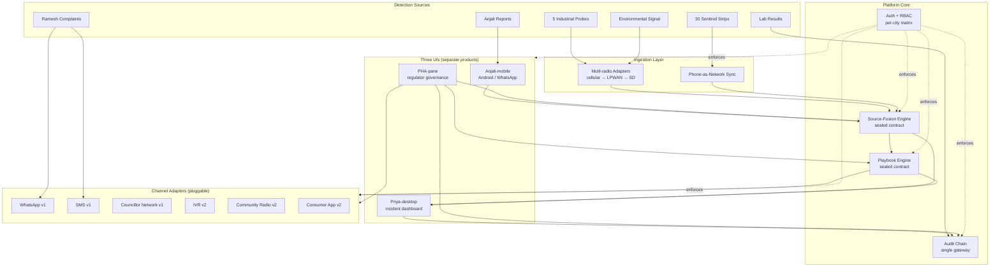

# Architecture Invariants — Surakkha v1

Companion to SPEC.md kernel. Holds diagrams, sealed-component contracts, and the component-seam matrix. The kernel's Constraints section (C-1, C-2, C-6, C-7, C-8, C-11) is the architectural ground truth; this companion details its seams.

---

## 1. Multi-tenant SaaS

The platform is multi-tenant from Day 1. v1 deploys to one city; the architecture supports federation; the v1 product does not exercise it.

**Invariants:**

- **Per-city database isolation.** Each tenant city has its own logical database. No cross-city joins at the storage layer.
- **Configurable per-city policies.** Threshold tables, escalation tier rules, contaminant-class weights, and role-permission matrices live per tenant. WHO-grounded defaults; PHA customizes per jurisdiction.
- **Separate audit-chain namespaces.** Each city's chain is rooted independently. Federation (v2+) operates on aggregated, jurisdiction-level roll-ups, never raw cross-city reads.
- **Federation-ready, not federation-active.** Federation hooks exist at the seam; v1 product surfaces do not call them.

---

## 2. Three UIs as separate products

The three UIs are separate products with separate design, deployment, and update cadences — not one responsive app collapsing across breakpoints.

| UI | Surface | Primary user | Inputs | Outputs | Core jobs |
|---|---|---|---|---|---|
| **Anjali-mobile** | Android, WhatsApp-fronted, low-bandwidth | Anjali (local operator) | Voice, image, weekly strip photo, free-text | One-tap incident reports, status feed, credential badge | Report fast; see that reports mattered |
| **Priya-desktop** | Web desktop dashboard | Priya (central city operator) | Ranked action list, playbook steps, handover brief | Deviation captures, overrides, PHA report export | Resolve incidents; pass shift cleanly |
| **PHA-pane** | Read-mostly regulator pane | Dr. Mensah (PHA Director) | Cross-ward aggregates, deviation dashboards, threshold controls | Playbook approvals, threshold edits, audit-chain browse | Govern; mandate standard; defend decisions |

The mobile surface is WhatsApp-fronted by design — Anjali does not download a training app. The desktop surface is incident-first, not data-first. The PHA pane is approval-and-tuning, not operational. Treating them as one responsive app would compromise the persona wins that drive adoption.

---

## 3. Source-fusion engine — sealed component contract

The fusion engine is the architectural seam where detection sophistication can grow without disturbing the response loop. **Interface stability is the invariant.**

**Contract:**

```
INPUTS (per incident context):
  - sensor:        industrial probe readings (5 in v1)
  - anjali:        local-operator report with credibility weight
  - complaint:     Ramesh-class citizen report cluster (≥3 in zone/24h)
  - lab:           lab sample result (when available)
  - env:           environmental signal (seasonality, rainfall, supply source)

OUTPUTS:
  - ranked_action_list: ordered 4–6 incidents to action
  - per_item:           playbook recommendation, source attribution,
                        corroborated confidence score
```

**v1 implementation:** weighted-voting with city-configurable per-contaminant-class weights. Source-credibility weights for Anjali are learned from her override-outcome history, updated weekly.

**v2 swap:** cross-city-trained ML model replaces the weight function. The five input channels and the ranked-list output do not change. Every consumer of the engine (Priya-desktop, PHA-pane, playbook engine) is insulated from the swap.

**Why sealed:** the response loop is the load-bearing v1 test. Detection sophistication must not stall operator UX or audit-chain semantics. The seam guarantees that ML can land when audit-chain data justifies it, not before.

---

## 4. Playbook engine — sealed component contract

The playbook engine holds codified organizational knowledge: WHO-grounded templates customized per jurisdiction, approved by the PHA, executed by the central operator, evolved through deviation.

**Contract surfaces:**

- **Execution.** Approved playbook steps bind to fusion-engine outputs; each step logs who, when, action, reasoning, outcome.
- **Deviation capture.** During live incident, the operator may deviate with friction but not block. Each deviation is a first-class audit object (who/when/what/why/outcome).
- **Amendment hooks.** Deviations cluster for monthly review; the system surfaces them as candidate amendments. Promotion-to-amendment closes the field-learning loop.
- **Versioning.** Every amendment produces a new version-of-record. Sign-off metadata (signer identity, timestamp, prior version) is captured.
- **Confidence score.** Each step carries a confidence score — lower for novel regions, higher for well-trodden cases — surfaced in the editor and during execution.
- **Simulator.** A 2-minute "what would have happened" dry-run for new configurations.

**Why sealed:** the playbook lifecycle is a legal surface (shared-liability hypothesis), a training surface (new-operator onboarding), and a product surface (PHA owns approval, vendor does not). The engine's behavior must be testable in isolation and its interfaces must not leak implementation into downstream modules.

---

## 5. Channel adapters

Consumer and operator messaging rides through a pluggable adapter layer. Each adapter implements a stable interface; the platform routes messages by channel policy without knowing adapter internals.

**v1 adapters (shipped):**

- **WhatsApp** — primary consumer channel; voice + image + text.
- **SMS** — authoritative-notice fallback; carries more legal weight than WhatsApp in target geographies; signed gateway.
- **Ward councillor network** — trust-bridging voice; messages routed through councillor carry more weight than system-issued messages.

**v2 adapters (planned):**

- IVR
- Community radio
- Dedicated consumer mobile app

The adapter interface is the seam. Adding IVR in v2 does not change the routing engine, the message-store, or the audit-chain writer.

---

## 6. Audit chain — single platform-level service

The append-only, cryptographically chained audit log is a load-bearing platform feature, not a compliance afterthought. It does three jobs from one data structure: operator legal defense, ML training fuel (v2+), and regulator forecasting.

**Invariants:**

- **Single gateway.** Every module writes through one gateway; no module writes directly to chain storage. This makes the chain format and signing policy enforceable in one place.
- **Append-only with cryptographic linking.** Each block references the prior block. Retroactive tampering is detectable.
- **Two-person rule.** Sensitive actions (playbook edits at T3 boundary, consumer message issuance) require dual signatures captured in the chain. **The two signatures must attest to the identical `(event_id, payload_hash, version_id)` triple** — a signature cannot land against a typo-correction v2 after the first attested v1. The implementation pattern (linked `SignatureAttestation` events; gateway accepts the underlying command only after both attestations with matching triples) is fixed in **AD-11 of the adopted architecture spine** at `_bmad-output/planning-artifacts/architecture/architecture-surakkha-2026-09-06/ARCHITECTURE-SPINE.md`. Two roles are not a substitute for one signature + attestation; the pattern is structural.
- **Read-access policy-controlled per role.** Priya sees her operator log; PHA sees cross-ward rollups; the audit-chain browser in the PHA pane is read-only and access-logged. The `actor_identity.role` is a closed enum tied to the per-city RBAC matrix (`{vendor, pha_approver, utility_operator, anjali, priya, pha_viewer, system}`), and `actor_identity.ref` is resolved from the auth-service session token, not minted by the emitting component — the gateway rejects events whose role is not in the closed enum or whose ref cannot be resolved to a live auth-session reference. See **AD-12** of the adopted architecture spine for the full rule.
- **Per-city namespace.** Chain roots are per-tenant. Federation operates on aggregated roll-ups, not raw cross-city reads.
- **Idempotency by `(tenant_id, event_id)`.** Every event carries a client-minted ULID; the gateway rejects duplicate pairs with `DuplicateEventRejected`. Mobile and SD-card adapters mint a stable `event_id` once per logical event at user-acknowledged submission time; retries reuse the same `event_id`. Silent dedup is forbidden — the chain must show the attempt. See **AD-14** of the adopted architecture spine.
- **Right-to-be-forgotten via `SubjectRedacted` tombstones.** The chain remains append-only and tamper-evident; RTBF is honored by emitting a tombstone event that downstream projections apply on read. Retention floor per tenant (default 7 years; set per WB / city contract — see C-16) is enforced by the chain-integrity monitor. See **AD-16** of the adopted architecture spine.

**Events recorded:** sensor calibration, threshold changes, playbook approvals and amendments, operator actions and deviations, consumer message issuance, system logins and permission grants, lab submissions and results, cross-system integrations (SCADA pulls, PHA dashboard reads).

---

## 7. Auth + RBAC

**Invariants:**

- **Role-permission matrix per city.** Each tenant city has its own matrix; the same global role name (e.g., "Priya") maps to city-specific permissions.
- **Defense-in-depth.** Permission checks at gateway, at service boundary, and at data-access layer. No single check is load-bearing.
- **Override-anomaly detection — logged in v1, enforced in v2.** Every override is captured with reasoning; v1 stores it for retrospective review; v2 will fire policy actions when override patterns deviate from peer baselines.
- **Access-logged operator data.** Every read of operator data produces an audit event. Privacy is a saleable feature; access logs are the proof.

The role matrix is the surface where per-city policy becomes enforceable. The audit chain is the surface where policy violations become visible.

---

## 8. Multi-radio connectivity tiers

Connectivity loss is expected operation, not exception. The architecture optimizes for the bad-day path.

**Tier mapping:**

| Tier | Site class | Power | Network | Difficulty |
|---|---|---|---|---|
| Source-grade | Intake, pump station | Mains | Fixed | Trivial |
| Pump-grade | Pump station | Mains, intermittent | Mostly connected | Medium |
| Distribution-grade | Distribution | Diesel generator | Intermittent | Hard |
| Tap-grade (sentinel) | School, hospital, community | No mains | Possibly no fixed network | Very hard |

**Multi-radio fallback:**

- **Primary:** cellular.
- **Secondary:** LPWAN.
- **Tertiary:** SD-card store-and-forward. Data uploads when connectivity returns.

**Ward sentinel uses phone-as-network.** Anjali's phone is the network endpoint for the sentinel strip. Offline-first sync; uploads when connectivity allows. This pattern inherits from community-health-worker systems that already operate in intermittent-connectivity environments.

**Architectural consequence:** every sensor path is an eventually-consistent write. Latency of action beats measurement accuracy — operators act on the most recent confirmed state, not on a freshness guarantee.

---

## 9. Architecture diagram

The architecture is a sealed-component system. Each box is a component with a stable interface; arrows cross seams, not implementations.



**Reading the diagram:** solid arrows are data and command flow at the sealed-component seams. Dotted arrows are policy enforcement from Auth+RBAC. The audit chain sits beside the core components — every component writes through it; none contains it.

---

## 10. Component-seam matrix

| Component | Reads from | Writes to | Sealed contract | v1 swaps in v2 |
|---|---|---|---|---|
| Source-fusion engine | Sensor, Anjali, complaint, lab, env | Ranked action list to Priya-desktop, PHA-pane, playbook engine | Inputs (5 channels) + outputs (ranked list with attribution) | ML weights replace voting; contract unchanged |
| Playbook engine | Fusion output, PHA approval queue | Operator steps, audit chain, deviation feed | Execution + deviation + amendment + versioning + confidence | Simpler dry-run; v2 adds auto-suggest from deviation clusters |
| Audit chain gateway | All modules | Chained storage | Append-only block with prior-hash reference + signatures | Federation roll-up reads; chain-write contract unchanged |
| Channel adapters | Operator/PHA action | WhatsApp / SMS / councillor / IVR / radio / app | Signed message + recipient scope + two-person attestation | Add IVR, radio, app; routing unchanged |
| Auth + RBAC | All modules | Permission decisions + access logs | Role-permission matrix per city + override-anomaly log | Enforce override-anomaly actions; matrix model unchanged |
| Multi-radio ingestion | Sensor endpoints | Source-fusion engine | Eventually-consistent sensor reading with provenance | Add radios; ingestion contract unchanged |

**The matrix is the v2-on ramp.** Every row identifies the swap point. Every consumer of a sealed component is insulated from the swap by the contract.
