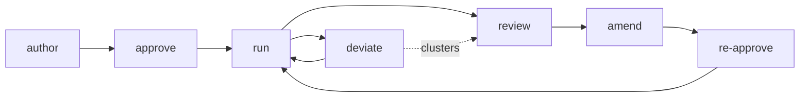

# Playbook Lifecycle — Companion to SPEC-surakkha-v1

The playbook is the unit of codified organizational knowledge. It is operator/utility-authored, not vendor-written. It is local, jurisdiction-specific, and explicitly designed to evolve from incidents. Public-health authorities (not mayors, not internal engineering) are the approval authority.

Lifecycle: **author → approve → run → deviate → review → amend → re-approve.**

## Lifecycle diagram

The loop closes on `run`: deviations and amendments feed back into the live playbook. The review node is the only stage that aggregates material from `run` and `deviate`.

## Stages

### 1. Author
- **Actor:** senior operator (Priya or her utility counterpart).
- **Action:** drafts in a structured editor with constraint checks against WHO templates. A confidence score surfaces on the draft — lower for novel regions, higher for well-trodden cases. The editor doubles as onboarding material: new operators learn the city's playbook as training material.
- **Artifact:** playbook draft (structured, constraint-checked, confidence-scored).
- **Audit log entry:** draft created; draft identifier; author identity; timestamp; WHO-template references used.

### 2. Approve
- **Actor:** PHA Director (Dr. Mensah). Vendor does not have approval authority.
- **Action:** reviews and signs the draft. Approval creates the version-of-record the live system loads.
- **Artifact:** signed version-of-record.
- **Audit log entry:** approver identity; approval timestamp; version-of-record identifier; dual signature if the playbook edits touch the T3 boundary (two-person rule).

### 3. Run
- **Actor:** Priya and her team.
- **Action:** operate against the approved playbook. Every action and every non-action is logged against the playbook step, with reasoning.
- **Artifact:** step-level execution log tied to the active version-of-record.
- **Audit log entry:** operator identity; playbook step executed; reasoning; outcome; timestamp.

### 4. Deviate
- **Actor:** Priya during a live incident.
- **Action:** deviates with friction but not blocked. Deviation is welcome; blame-free review is the goal. Each deviation is a first-class audit object.
- **Artifact:** deviation record (who / when / what / why / outcome).
- **Audit log entry:** full deviation object captured as a distinct audit event type, not folded into the step-execution log.

### 5. Review
- **Actor:** PHA + utility + vendor, monthly.
- **Action:** post-incident and monthly review clusters of deviations. Patterns indicate either a bad playbook step (system problem) or a uniquely good operator instinct (training material).
- **Artifact:** deviation cluster report; candidate amendment list.
- **Audit log entry:** review session opened; participants; clusters reviewed; candidate amendments recorded.

### 6. Amend
- **Actor:** senior operator (Priya or her utility counterpart), authoring the edit.
- **Action:** edits the playbook in response to review. **Deviations promote into playbook amendments** — that is how playbooks actually evolve. The system treats operator deviation as a leading indicator of where the playbook is wrong, not as a compliance failure.
- **Artifact:** amended draft.
- **Audit log entry:** amendment author; lineage to source deviation(s) that motivated it; prior version-of-record identifier.

### 7. Re-approve
- **Actor:** PHA Director (Dr. Mensah).
- **Action:** signs the amendment. New version-of-record.
- **Artifact:** new signed version-of-record, supersedes prior.
- **Audit log entry:** approver identity; approval timestamp; version transition recorded (prior → new); dual signature if the amendment touches the T3 boundary.

## Deviation policy

Deviation is **first-class**, not an exception path. Without explicit deviation support, operators game the system: they match playbook steps formally but execute different intents. With deviation-with-reasoning plus blame-free review plus promotion-to-amendment, the system captures **real field learning** and turns it into institutional knowledge. Without it, the playbook decays the moment the city changes — new piping, new supplier, new season.

**Promotion-to-amendment.** Deviations surfaced at review that indicate a systematic gap become amendment candidates. Lineage is recorded: the amendment references the deviation cluster that motivated it. The audit chain preserves the link from incident to institutional learning.

**Review cadence.** Monthly, jointly by PHA, utility, and vendor. Ad hoc reviews may be triggered by a single high-severity deviation cluster, but the standing cadence is monthly.

## Liability — resolved (C-13)

When a playbook step is wrong and harm results, **liability is split, not shared**:

- **Vendor** carries **platform-integrity liability**: the system worked as designed (audit chain intact, two-person rule enforced, deviation captured, data not lost, fusion inputs authenticated). The vendor's exposure ends at the platform boundary.
- **PHA** carries **approval liability**: the playbook step that was wrong was approved under PHA signature. The PHA owns the threshold, the playbook content, and the approval act.
- **Utility** carries **operational liability**: the operator (Priya) executed the playbook as approved, or deviated with reasoning; the utility owns operations within the approved playbooks.

The audit chain is the **evidence surface** that proves which party committed to which decision, signed by which identity, at which timestamp. Wrong playbook step → audit chain shows who approved it, who executed it, and what the deviation record was. Liability flows from the chain.

This split makes vendor-disclaims-liability defensible: the vendor's liability is bounded to platform integrity; everything else is city-owned through the city contract. Insurance, legal exposure, and public communications map cleanly to this line. C-13 captures the constraint at the kernel level; the bad-lot discipline in `detection-layer.md` §3a captures the parallel split for sentinel QA.

The vendor, PHA, and utility each carry written-city-contract terms that codify this split. C-13 must be reflected in every lighthouse-city contract before launch.
