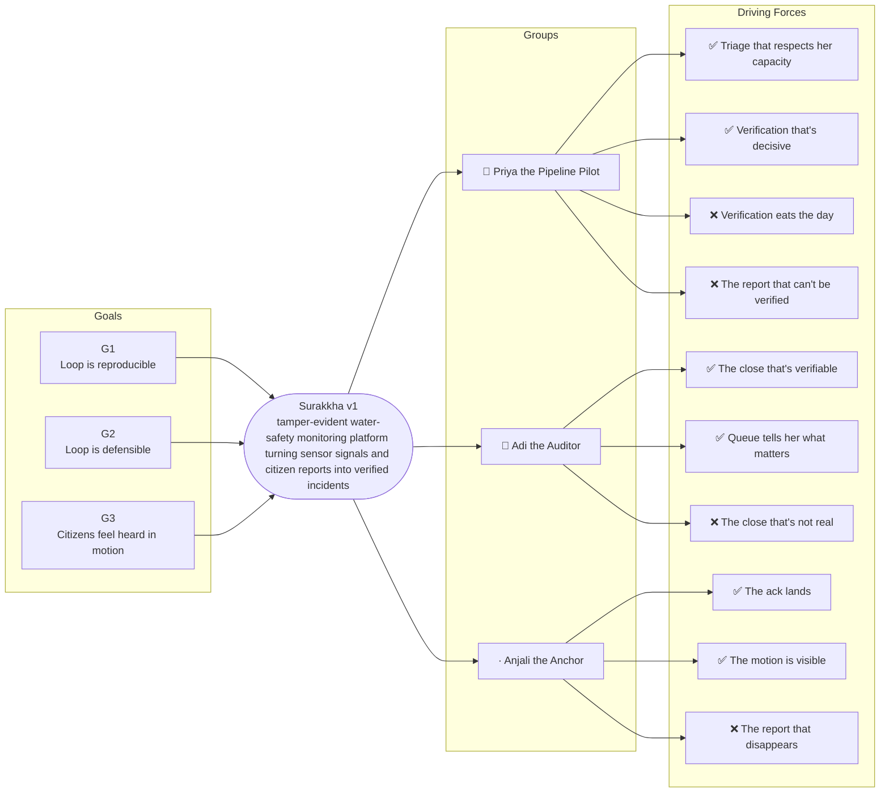

# Trigger Map — Surakkha v1

> Phase 2 — Trigger Mapping
> Source: Workshops 1–4, product-brief.md
> Status: Draft — pending review

---

## The Map

---

## Business Goals

| Goal | Vision | Key Objectives |
|------|--------|----------------|
| G1 | Loop is reproducible | 1.1 Report lands within 60s · 1.2 100% of chain events fire on incoming reports · 1.3 End-to-end demo runs <30 min on demand |
| G2 | Loop is defensible | 2.1 Chain verifiable by independent hash recomputation · 2.2 100% of writes anchored to playbook with reasoning · 2.3 100% of chain reads logged |
| G3 | Citizens feel heard in motion | 3.1 "Got heard" ack within 5 min · 3.2 "In progress" signal at every state transition · 3.3 Closure ack with ✅/❌ within 1 hour of `IncidentClosed` |

→ Full detail: [01-business-goals.md](01-business-goals.md)

---

## Target Groups

| Priority | Persona | Goals served | Persona page |
|----------|---------|--------------|--------------|
| 👥 Primary | Priya the Pipeline Pilot (action lane — load-bearing Phase 1 user) | G1, G2, G3 | [03-persona-priya-the-pipeline-pilot.md](03-persona-priya-the-pipeline-pilot.md) |
| 👤 Secondary | Adi the Auditor (decision lane — verifier, closer) | G1, G2, G3 | [05-persona-adi-the-auditor.md](05-persona-adi-the-auditor.md) |
| · Tertiary | Anjali the Anchor (source lane — citizen edge) | G1, G2, G3 | [04-persona-anjali-the-anchor.md](04-persona-anjali-the-anchor.md) |

**Constraint persona (not a target group user):** Pia the Public Health Authority — no Phase 1 UI; forces shape the Phase 1 data contract and the Phase 2 PHA dashboard. Forces listed separately below.

→ Full detail: [02-persona-pia-the-public-health-authority.md](02-persona-pia-the-public-health-authority.md)

---

## Driving Forces — Priority Summary

Sorted by FIA score (Frequency + Intensity + Fit /15). Scores ≥ 13 are high-priority design inputs. In-phase forces only (positive + negative forces actively shaping Phase 1 design). Deferred-positive forces from Pia are listed in a separate section below the main table.

| Score | Force | Group | Direction |
|-------|-------|-------|-----------|
| **15** | Triage that respects her capacity | Priya | ✅ Positive |
| **15** | Verification that's decisive | Priya | ✅ Positive |
| **15** | Verification eats the day | Priya | ❌ Negative |
| **15** | The close that's verifiable | Adi | ✅ Positive |
| **15** | The report that disappears | Anjali | ❌ Negative |
| **15** | The ack lands | Anjali | ✅ Positive |
| **15** | The motion is visible | Anjali | ✅ Positive |
| **14** | Resolution that's real | Priya | ✅ Positive |
| **14** | The report that can't be verified | Priya | ❌ Negative |
| **14** | Queue tells her what matters | Adi | ✅ Positive |
| **14** | The closure is real and acknowledged | Anjali | ✅ Positive |
| **13** | The resolution that doesn't resolve | Priya | ❌ Negative |
| **13** | The close that's not real | Adi | ❌ Negative |
| **13** | Karim's proof is reliably good | Adi | ✅ Positive |
| **13** | System defends her, not the other way around | Adi | ✅ Positive |

### Deferred-Positive Forces (Phase 2+ — do not shape Phase 1 design)

| Score | Force | Group | Direction |
|-------|-------|-------|-----------|
| **13** | Trust band is correct, demonstrably | Pia | ✅ Positive *(deferred — Phase 2 PHA dashboard)* |
| **13** | Resolution is real, not paper | Pia | ✅ Positive *(deferred — Phase 2 PHA dashboard)* |
| **13** | Citizens keep reporting because it works | Pia | ✅ Positive *(depends on Phase 1 landing cleanly)* |
| **13** | Spend is traceable to resolved incidents | Pia | ✅ Positive *(deferred — WB review surface)* |
| **13** | Citizens stop reporting because no one came | Pia | ❌ Negative *(in-phase, but Pia is constraint — surfaces via Anjali's "report disappears" force above)* |
| **13** | Money doesn't reach the problem | Pia | ❌ Negative *(deferred — WB review surface)* |
| **14** | Accountability vanishes into the system | Pia | ❌ Negative *(deferred — Phase 2 PHA dashboard)* |
| **14** | Clear accountability, owned by named roles | Pia | ✅ Positive *(deferred — Phase 2 PHA dashboard)* |

_Note: Pia's in-phase negative forces (Wrong incidents 15; Solved on paper 15; Accountability vanishes 14; Citizens stop reporting 13; Money doesn't reach 13) and in-phase positive forces (Trust band correct 15; Resolution real 15; Clear accountability 14; Citizens keep reporting 13; Spend traceable 13) are listed in the deferred table because Pia has no Phase 1 UI. They shape the Phase 1 data contract so that the Phase 2 PHA dashboard can answer them. The two forces with FIA 13 from Pia that mirror active in-phase concerns (Citizens stop reporting / Citizens keep reporting; Money doesn't reach / Spend traceable) are deferred-positive; their in-phase counterparts already appear in the main table via Anjali (report disappears / ack lands / motion visible) and via Priya (verification eats the day / triage that respects capacity)._

**Key read:** The priority pattern reveals that **Phase 1 is dominated by decision-quality fears at the operator surface, with citizen-trust worries at the edge** — Priya's top forces all sit at FIA 15 and cluster around "can I verify and dispatch this incident decisively," while Anjali's top forces all sit at FIA 15 and cluster around "did the system see me and is it moving." Adi's load-bearing force (the close that's verifiable, FIA 15) ties the two ends together: the close is defensible *because* the verification was decisive and the citizen ack arrived. The implication for design is that the verification step (Priya's UI + sensor cross-check) and the closure step (Adi's UI + citizen-ack dispatch) are the two load-bearing surfaces — **not the chain explorer and not the citizen's submit form**. Build the decision-quality surfaces first; the trust surfaces will follow.

---

_Produced by Saga — 2026-09-10_
_Source: 01-business-goals.md, 02-persona-pia-the-public-health-authority.md, 03-persona-priya-the-pipeline-pilot.md, 04-persona-anjali-the-anchor.md, 05-persona-adi-the-auditor.md_
